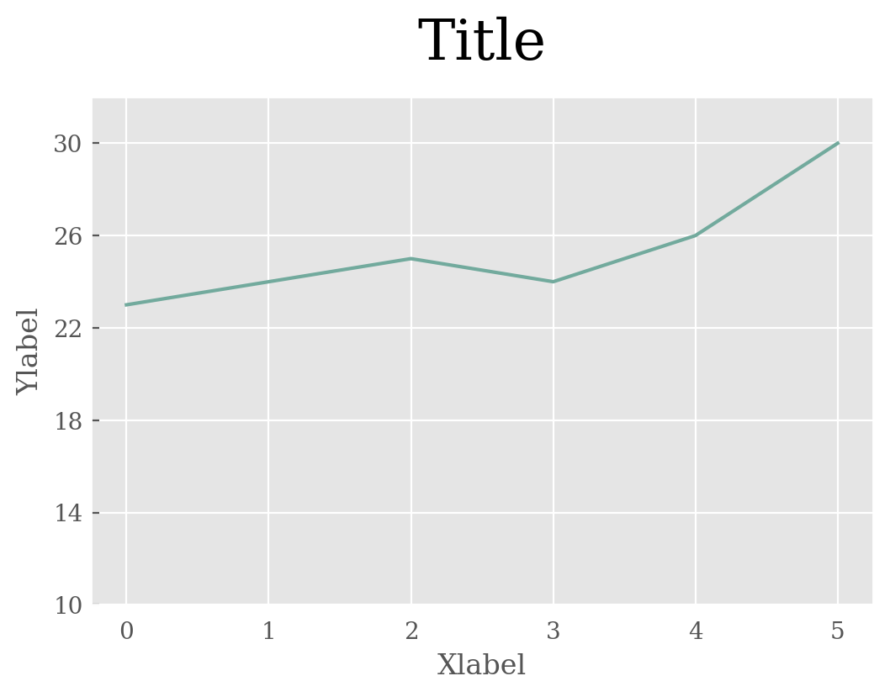

# Elegant-Plot
Plot toolbox based on Matplotlib, simple and elegant.
 

## 绘制展示
### 对比
 |  | 
:---:|:---:|:---:
[柱状图](./对比/柱状图/SS_Bar.py)| [纹理柱状图](./对比/柱状图/SS_Bar.py) | [多系列柱状图](./对比/多系列柱状图/MS_Bar.py)

 |  | 
:---:|:---:|:---:
[极坐标柱状图](./对比/极坐标柱状图/circle_Bar.py)| [多系列极坐标柱状图](./对比/多系列极坐标柱状图/MS_circle_Bar.py) | [棒棒糖图](./对比/棒棒糖图/Stem.py)

 |  | 
:---:|:---:|:---:
[折线图](./对比/折线图/line.py)| [雷达图](./对比/雷达图/spider.py) | [雷达图](./对比/雷达图/spider.py)

### 相关性
 |  | 
:---:|:---:|:---:
[散点图](./相关性/散点图/scatter.py)| [散点图(带概率密度)](./相关性/散点图(带概率密度)/scatter.py) | [散点图(带概率密度)](./相关性/散点图(带概率密度)/scatter.py)

## 绘制过程
### 数据准备
每种图标类型的目录下有`data.csv`文件，依据样例数据填入自己的数据。
### 绘制设置
每种图表都被单独封装成函数，可直接运行对应文件绘图，绘制结果以PDF格式保存在当前文件夹下。

&emsp;&emsp;例：绘制单系列柱状图 `python SS_bar.py`

自定义设置见函数的参数列表：

&emsp;&emsp;`plotbar(style='ggplot', color='#72aa9d', Title='Title', Xlabel='Xlabel', Ylabel='Ylabel')`

## 运行环境
- Python = 3.9.7
- matplotlib = 3.5.0
- pandas = 1.3.5
- numpy = 1.20.3
- seaborn = 0.11.2
